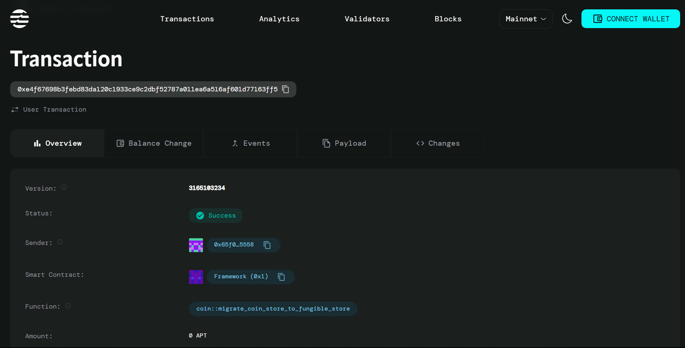

# No Code LMS Builder with Aptos Payments

## Overview
This project is designed to provide a no-code solution for building Learning Management Systems (LMS) using Aptos blockchain technology. Users can create, manage, and deploy their LMS without needing to write code.

## Description
This project is a no-code learning management system (LMS) that integrates Aptos payments, allowing users to create and manage courses without any coding knowledge.

## Vision
To empower educators and learners by providing an accessible platform for online education, enabling seamless payment processing through Aptos.

## Future Scope
Future enhancements may include adding features like analytics, user feedback systems, and integration with other educational tools to improve the learning experience.

## Features
- Secure transactions using Aptos blockchain.
- User-friendly interface for managing payments.
- Comprehensive documentation for developers.

## Setup Instructions
1. Clone the repository:
   ```bash
   git clone <repository_url>
   cd <repository_name>
   ```
2. Install dependencies:
   ```bash
   npm install
   ```
3. Configure your environment variables as needed.

## Contract Address
- The deployed contract address will be provided after deployment.

## Additional Information
This project utilizes the Aptos blockchain for secure and efficient transactions. Make sure to check the documentation for more details on how to interact with the smart contract.

## Deployment Instructions
1. Ensure you have the Aptos CLI installed.
2. Run the following command to deploy the contract:
   ```bash
   aptos move publish --package-dir <path_to_your_package>
   ```
3. Verify the deployment by checking the contract address.

## Screenshots
